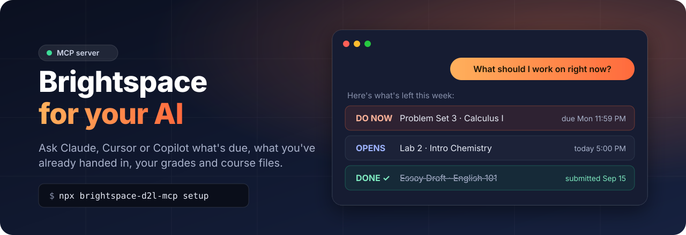
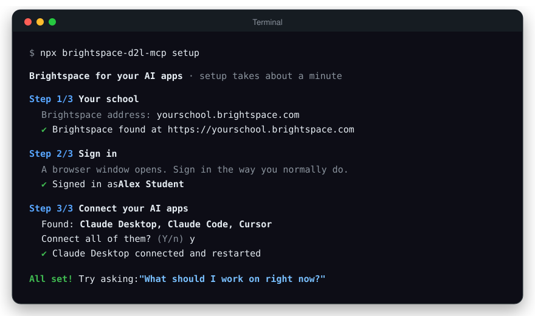
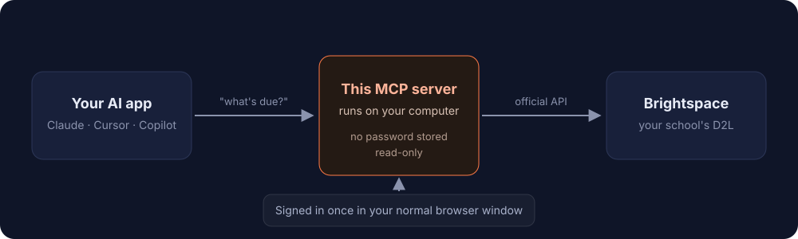

<h1 align="center">Brightspace D2L MCP Server</h1>

<p align="center">
  
</p>

<p align="center">
  <a href="https://www.npmjs.com/package/brightspace-d2l-mcp"></a>
  <a href="https://github.com/AnonymousOnyx22/brightspace-d2l-mcp/actions/workflows/ci.yml"></a>
  
  <a href="LICENSE"></a>
</p>

<h3 align="center">Connect D2L Brightspace to Claude, ChatGPT, Cursor, Copilot<br>or any AI agent in about a minute.</h3>

<p align="center">One command. Sign in the way you always do. No passwords stored.</p>

<br>

An [MCP (Model Context Protocol)](https://modelcontextprotocol.io) server that gives AI assistants and agents read access to your Brightspace courses: due dates with real submission status, grades, assignments, rubrics, course content, announcements, discussions and class lists. It works at any school that uses D2L Brightspace, including schools with Microsoft, Duo, Okta or Shibboleth single sign-on.

## Quick start

You need [Node.js 20 or newer](https://nodejs.org/) and Google Chrome or Microsoft Edge.

```bash
npx brightspace-d2l-mcp setup
```

That's it. Setup asks for your school, opens a browser so you can sign in, and connects every AI app it finds.
Then ask your AI:

> **"What should I work on right now?"**

<p align="center">
  
</p>

New to this? The **[step-by-step setup guide](docs/setup.md)** walks through everything with pictures of each step.

## What you can ask

| | Try asking |
|---|---|
| ✅ **What's left** | "What should I work on right now?" · "What haven't I submitted yet?" |
| 📅 **Deadlines** | "What's due this week?" · "Anything due tomorrow?" |
| 📊 **Grades** | "What are my grades?" · "Am I passing Calculus?" |
| 📢 **Announcements** | "Did any professor post something today?" |
| 📚 **Course content** | "Find the midterm review slides" · "Summarize the Lab 3 instructions" |
| 📎 **Assignment files** | "What does the rubric for the project ask for?" |
| 💬 **Discussions** | "What are people saying in the final project thread?" |
| 👥 **Class list** | "Who's the TA for my networking course?" |

### It knows what you've already handed in

Most tools only see due dates, so they keep telling you to do work you've finished.
This one checks your actual submission for every assignment:

| Status | Meaning |
|---|---|
| `submitted` / `graded` | Done. Never suggested as a to-do. |
| `not_submitted` / `draft` | Still needs doing. |
| `not_open_yet` | The dropbox hasn't opened; shows when it will. |
| `closed` / `past_due` | You can no longer submit. |
| `unknown` | Quizzes: Brightspace doesn't show students their quiz attempts, so your AI will ask you. |

## Tools

13 read-only MCP tools for D2L Brightspace:

| Tool | What it does |
|---|---|
| `get_todo` | Prioritized to-do list across every course: what's due soon, overdue, not open yet, and already done |
| `get_upcoming_due_dates` | Upcoming deadlines with the real submission status of each assignment |
| `get_my_courses` | Your enrolled courses with names, codes and ids |
| `get_my_grades` | Grade breakdown per course with points, percentages and instructor comments |
| `get_assignments` | Assignments (dropboxes) and quizzes with due dates, status and rubrics |
| `get_assignment_files` | Reads the instructions, handouts and rubric files attached to an assignment |
| `get_course_content` | Course modules, lecture slides, files and links |
| `get_syllabus` | Course syllabus and overview |
| `get_announcements` | Recent announcements (news) from your instructors |
| `get_discussions` | Discussion forums, topics and posts |
| `get_roster` | Instructors and TAs with contact info, optionally the full class list |
| `get_classlist_emails` | Email addresses for everyone in a course |
| `download_file` | Saves a course file or submission to a folder you choose |

## Works at any Brightspace school

Every school signs in differently: Microsoft, ADFS, Duo, Shibboleth, Okta, Google, campus pickers, or Brightspace's own form.
Instead of guessing how your school works, setup opens a **normal browser window** and you sign in exactly like you do every day, text codes and authenticator apps included.

<p align="center">
  
</p>

After that it stays signed in quietly in the background. If your school ever asks you to sign in again, the browser window simply pops up and closes by itself when you're done.

## Works with your AI app or agent

**Connected automatically by setup:**
Claude Desktop · Claude Code · Cursor · VS Code (GitHub Copilot) · Windsurf · OpenAI Codex · Gemini CLI · Cline · Roo Code · OpenCode · Zed · LM Studio · Kiro

**One copy-paste away:**
ChatGPT (developer mode) · Continue · Goose · JetBrains AI Assistant · Warp · Amp · Msty · Jan · AnythingLLM

**Agent frameworks:**
OpenAI Agents SDK · Claude Agent SDK · LangChain / LangGraph · Vercel AI SDK · Mastra · CrewAI · Pydantic AI · LlamaIndex

It runs over **stdio** for local apps and **streamable HTTP** (`serve --http`) for ChatGPT and hosted agents.
See **[docs/agents.md](docs/agents.md)** for copy-paste setup for every one of these.

## Commands

| Command | What it does |
|---|---|
| `npx brightspace-d2l-mcp setup` | Pick your school, sign in, connect your AI apps |
| `npx brightspace-d2l-mcp login` | Sign in again |
| `npx brightspace-d2l-mcp status` | Show your school, whether you're signed in, and connected apps |
| `npx brightspace-d2l-mcp logout` | Delete the saved session |
| `npx brightspace-d2l-mcp uninstall` | Remove from all AI apps and delete all local data |
| `npx brightspace-d2l-mcp serve --http` | Run over HTTP for ChatGPT and HTTP-based agents |
| `npx brightspace-d2l-mcp config` | Print the MCP config JSON for any other app |

<details>
<summary><b>Setup options</b></summary>

```bash
npx brightspace-d2l-mcp setup --school yourschool.brightspace.com   # skip the school question
npx brightspace-d2l-mcp setup --apps claude-desktop,cursor          # only connect these apps
npx brightspace-d2l-mcp setup --skip-login                          # sign in later, on first use
npx brightspace-d2l-mcp setup --yes                                 # accept every default
```

App ids: `claude-desktop`, `claude-code`, `cursor`, `vscode`, `windsurf`, `codex`, `gemini-cli`, `cline`, `roo-code`, `opencode`, `zed`, `lm-studio`, `kiro`.

</details>

## Privacy and security

- **Your password is never seen or stored.** You type it into your school's own sign-in page in a real browser.
- **Read-only.** It can't submit, post, or change anything in Brightspace.
- **Local only.** Everything runs on your computer and talks only to your school's Brightspace. There's no server in between, and no analytics.
- **Uses the official Brightspace API** with the same access you have in your browser.
- Your session is saved in `~/.brightspace-d2l-mcp/`, readable only by your user account. `logout` deletes it; `uninstall` deletes everything.

## Troubleshooting

<details>
<summary><b>"No supported browser was found"</b></summary>

Install [Google Chrome](https://www.google.com/chrome/) or use Microsoft Edge (already on Windows).
Or install a private copy of Chromium with `npx playwright install chromium`.
</details>

<details>
<summary><b>My school address isn't accepted</b></summary>

Sign in to Brightspace in your browser, then copy the address from the address bar (any page works).
If it says your site "runs Blackboard" or "Canvas", your school doesn't use Brightspace.
</details>

<details>
<summary><b>Brightspace doesn't show up in Claude Desktop</b></summary>

Fully quit Claude Desktop (tray icon → Quit, not just closing the window), then run `setup` again.
Claude Desktop rewrites its settings while it's open, so setup offers to restart it for you.
</details>

<details>
<summary><b>It keeps asking me to sign in</b></summary>

Some schools end sessions every few hours. When that happens a browser window opens so you can sign in again.
Run `npx brightspace-d2l-mcp status` to check, or `login` to sign in right away.
If you'd rather it never opens a window on its own, add `"autoLogin": false` to `~/.brightspace-d2l-mcp/config.json`.
</details>

<details>
<summary><b>I want to filter out old courses</b></summary>

Add course ids to `~/.brightspace-d2l-mcp/config.json`:

```json
{ "excludeCourses": [123456, 789012] }
```

Or keep only specific ones with `"includeCourses"`. Ask your AI "list my courses with their ids" to find them.
</details>

## FAQ

<details>
<summary><b>How do I connect D2L Brightspace to Claude?</b></summary>

Run `npx brightspace-d2l-mcp setup`. It connects Claude Desktop and Claude Code automatically. Then ask Claude about your courses.
</details>

<details>
<summary><b>Is there an AI assistant for D2L Brightspace?</b></summary>

Yes. This connects Brightspace to the AI app you already use (Claude, ChatGPT, Cursor, GitHub Copilot, Gemini and others), so you can ask about deadlines, grades and course files in plain English instead of clicking through every course.
</details>

<details>
<summary><b>How do I use ChatGPT with Brightspace?</b></summary>

Run `npx brightspace-d2l-mcp serve --http`, expose it with a tunnel, and add the URL as a connector in ChatGPT developer mode. [docs/agents.md](docs/agents.md#chatgpt) walks through each step.
</details>

<details>
<summary><b>How do I connect Brightspace to Cursor, VS Code Copilot or Windsurf?</b></summary>

Run `npx brightspace-d2l-mcp setup`. It finds Cursor, VS Code, Windsurf and 10 other apps and connects them for you.
</details>

<details>
<summary><b>Can I use this with ChatGPT, a custom agent, or the Claude Agent SDK?</b></summary>

Yes. Local agents and SDKs launch it with `npx -y brightspace-d2l-mcp@latest`, and ChatGPT or HTTP-based agents use `npx brightspace-d2l-mcp serve --http`. [docs/agents.md](docs/agents.md) has copy-paste setup for ChatGPT, the OpenAI Agents SDK, Claude Agent SDK, LangChain, Vercel AI SDK and more.
</details>

<details>
<summary><b>Does it need an API key or admin access from my school?</b></summary>

No. Brightspace API keys normally require an administrator. This uses your own student sign-in instead, so it sees exactly what you see in Brightspace, and nobody at your school has to set anything up.
</details>

<details>
<summary><b>Does it work with Duo, Microsoft Authenticator or text-message codes?</b></summary>

Yes. You sign in yourself in a real browser window, so any sign-in method your school uses works.
</details>

<details>
<summary><b>Which schools does it work with?</b></summary>

Any school on D2L Brightspace, whether the address looks like `yourschool.brightspace.com`, `yourschool.desire2learn.com`, or a custom domain like `learn.yourschool.edu`.
</details>

<details>
<summary><b>Can it submit assignments or post for me?</b></summary>

No. It's read-only on purpose.
</details>

<details>
<summary><b>Is this made by D2L?</b></summary>

No. It's an independent open-source project that uses the official Brightspace API with your own sign-in. It isn't affiliated with or endorsed by D2L.
</details>

## Development

```bash
git clone https://github.com/AnonymousOnyx22/brightspace-d2l-mcp.git
cd brightspace-d2l-mcp
npm install
npm run build
npm test
node build/index.js setup     # connects your AI apps to this local build
```

Tools live in [`src/tools/`](src/tools), sign-in in [`src/auth/`](src/auth), and setup in [`src/cli/`](src/cli).
Issues and pull requests are welcome.

## License

[MIT](LICENSE) © AnonymousOnyx22

D2L and Brightspace are trademarks of D2L Corporation. This project is not affiliated with D2L.
